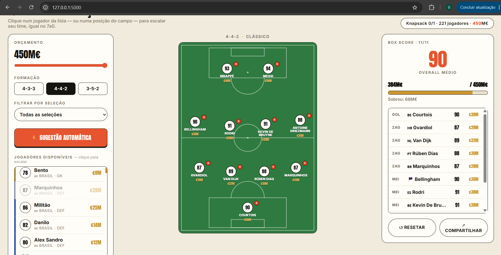

# G18\_Programacao\_Dinamica\_PA-26.1

**Número da Lista**: 18<br>
**Conteúdo da Disciplina**: Programação Dinâmica<br>

## Alunos

| Matrícula | Aluno |
| -- | -- |
| 202016382 | Guilherme Meister Correa |
| 202063462 | Samuel Alves Silva |

## Sobre

Este projeto implementa o **Problema da Mochila (Knapsack 0/1)** aplicado a um cenário de futebol — montar a melhor seleção possível para a Copa do Mundo 2026 dentro de um orçamento limitado.

Um catálogo com mais de 220 jogadores (goleiros, defensores, meio-campistas e atacantes) das 14 maiores seleções, cada um com **overall** (nota) e **preço** (em milhões de euros), é usado como entrada. A interface é inspirada no jogo viral **7a0 (Sete a Zero)**: o usuário pode escolher manualmente cada jogador, posição por posição, clicando na lista ou diretamente no campo — ou apertar **SUGESTÃO AUTOMÁTICA** para que o algoritmo de **programação dinâmica** monte a escalação que maximiza o overall total sem ultrapassar o orçamento, deixando o orçamento fluir livremente entre as posições (veja [Outros](#outros)).

O resultado é exibido em uma interface web interativa (Flask + JS), com:

| Elemento | Descrição |
|---|---|
| Painel de controles | Slider de orçamento, escolha de formação, filtro por seleção e lista clicável de jogadores |
| Campo tático | Os 11 slots da formação, preenchidos manualmente ou pela sugestão automática |
| Box score | Overall médio do time, gasto total, valor restante e lista dos titulares |

## Apresentação

[](https://youtu.be/2fCs750-sRM)

## Screenshots

| Dream Team Builder |
|---|
|  |

## Instalação

**Linguagem**: Python 3.8+<br>
**Dependências**: `Flask`

Clone o repositório e instale as dependências:

```bash
git clone https://github.com/projeto-de-algoritmos-2026/G18_Programacao_Dinamica_PA-26.1.git
cd G18_Programacao_Dinamica_PA-26.1
pip install flask
```

## Uso

Execute o servidor Flask na raiz do repositório:

```bash
python app.py
```

Acesse `http://127.0.0.1:5000` no navegador. Na interface:

1. Ajuste o **orçamento** (em milhões de euros) usando o slider.
2. Escolha a **formação** (4-3-3, 4-4-2 ou 3-5-2).
3. (Opcional) **Filtre por seleção** para montar um time apenas com jogadores de um país.
4. **Escolha manualmente**: clique num jogador da lista para escalá-lo na primeira vaga livre da posição dele, ou clique numa posição já preenchida no campo para substituir o titular. Clique no **×** de um slot para esvaziá-lo.
5. Ou clique em **⚡ SUGESTÃO AUTOMÁTICA** para que o algoritmo monte a melhor escalação dentro do orçamento de uma vez.
6. Use **RESETAR** para limpar o time montado e **COMPARTILHAR** para copiar a escalação como texto.

## Outros

### Como funciona a Programação Dinâmica (Knapsack 0/1 com vagas limitadas)

A sugestão automática (`montar_time` em `app.py`) resolve o problema em duas etapas de DP:

**1. Por posição — knapsack 0/1 com limite de itens**

```
_tabela_posicao(jogadores, vagas, W):
    dp[i][k][w] = maior overall somado escolhendo EXATAMENTE k jogadores
                  distintos entre os i primeiros candidatos da posição,
                  com custo total <= w

    para cada jogador i (1..n):
        para cada k (0..vagas):
            para cada orçamento w (0..W):
                dp[i][k][w] = dp[i-1][k][w]                                  # não pega o jogador i
                se k > 0 e preco[i] <= w:
                    dp[i][k][w] = max(dp[i][k][w], overall[i] + dp[i-1][k-1][w-preco[i]])  # pega o jogador i

    backtracking comparando dp[i][k][w] com dp[i-1][k][w] recupera os jogadores escolhidos
```

A dimensão `k` é o que diferencia esse knapsack do clássico: sem ela, o algoritmo poderia gastar todo o orçamento em poucos jogadores caros e deixar vagas vazias mesmo havendo opções baratas disponíveis.

**2. Entre posições — convolução de orçamento (max, +)**

Dividir o orçamento total de forma fixa e proporcional entre GK/DEF/MID/ATK deixa "sobras" presas numa posição barata (ex. goleiro) que não podem cobrir uma posição cara (ex. ataque) — o time fica incompleto mesmo havendo orçamento total suficiente. Por isso as quatro tabelas de posição são combinadas par a par:

```
_combina_orcamento(f, g, W):
    para cada orçamento total w (0..W):
        h[w] = max sobre w1 + w2 <= w de f[w1] + g[w2]
```

testando toda divisão possível do orçamento entre os dois grupos e guardando a melhor. Repetindo essa combinação três vezes (GK+DEF, +MID, +ATK), o orçamento flui livremente entre posições e o time fecha completo a partir de ~205M€ para qualquer seleção e formação — bem perto do custo mínimo teórico (~201M€).

- **Subestrutura ótima**: a melhor escolha de k jogadores entre os i primeiros depende apenas da melhor escolha entre os i−1 primeiros.
- **Subproblemas sobrepostos**: `dp[i][k][w]` é reaproveitado por várias combinações de jogadores, vagas e orçamentos.
- **Complexidade**: O(n · vagas · W) por posição, mais O(W²) por combinação entre posições (3 combinações no total) — todas pequenas o suficiente para rodar em menos de 150ms por requisição.
